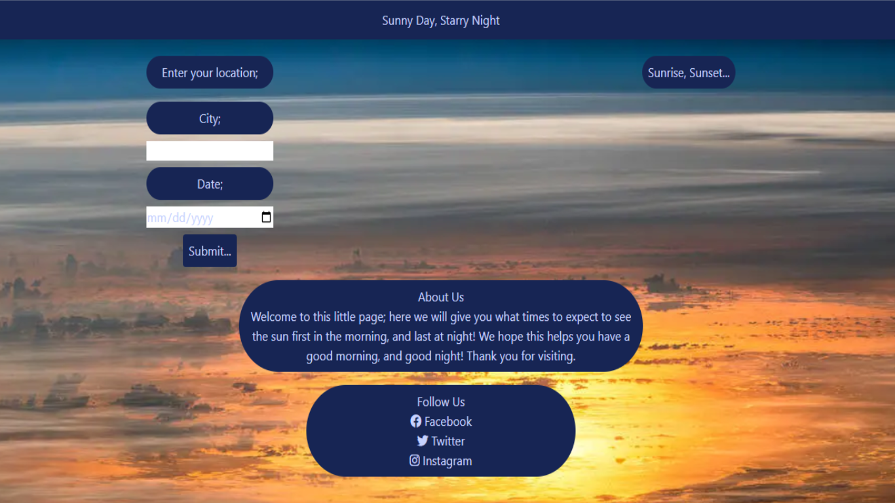

# Sunset/rise Time Generator

## Description

This app allows you to enter your city, and date to get the sunrise and sunset of your day. Using two APIs, we gather the lattitude and longitude of your location, to access the information regarding how your day is going to look.

## Table of Content

- [Installation](#installation)
- [Usage](#usage)
- [Credits](#credits)
- [License](#license)
- [Badges] (#badges)
- [Features] (#features)

## Installation

To install this code use `git clone` to clone the repository, `git status` to make sure your copy is up to date or `git pull` to update it. Here [link](https://khmaister.github.io/Star-Map-Generator/) you can find the live site, which will appear as such when loaded: 

## Usage

To use this site, simply enter your city for the geolocater to find your lattitude, and longitude, then enter the date you would like to know the times of the sunset, and sunrise of.

## Credits

This website was created by the coding skills of khmaister [link](https://github.com/khmaister), rickdeakins [link](https://github.com/rickdeakins), MahmoudAhmed0528 [link](https://github.com/MahmoudAhmed0528), and KC-Nick [link](https://github.com/KC-Nick). The image used in the background was taken and posted by NASA [link](https://www.nasa.gov/image-article/sunset-from-international-space-station/).

## License

TBA.

## Badges

TBA.

## Features

This project features code using APIs; [link](https://geocode.maps.co/), and [link](https://sunrise-sunset.org/api). It uses them to geolocate the lattitude and longitude of a given city, and plug them in to find the times of a sunrise and sunset, respectively.
